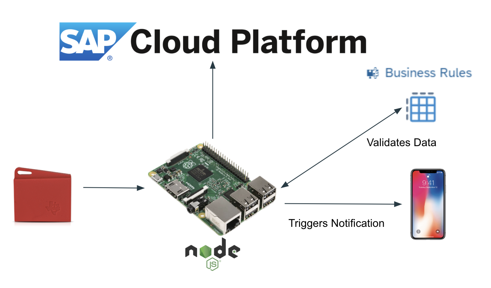

# FIT4002 - SensorTag Gateway
A gateway which discovers your SensorTag and sends data from it to SAP Cloud Platform.

#Architecture 



# Features
* Read data from SensorTag
* Push data to SAP Cloud Platform's IoT Service (MMS)
* Send data to SAP Cloud Platform's Business Rules service in order to detect abnormal data
* Send push notifications to [iOS devices](https://github.com/FIT4002-SAP/SAP) through SAP Mobile Service when abnormal data is detected.

## How to run
```
npm install
node gateway.js
```

## Compatibility
* Built for SensorTag CC2650STK
* Built on NodeJS

## Issues & PR
Please list this as an issue on this repo.
